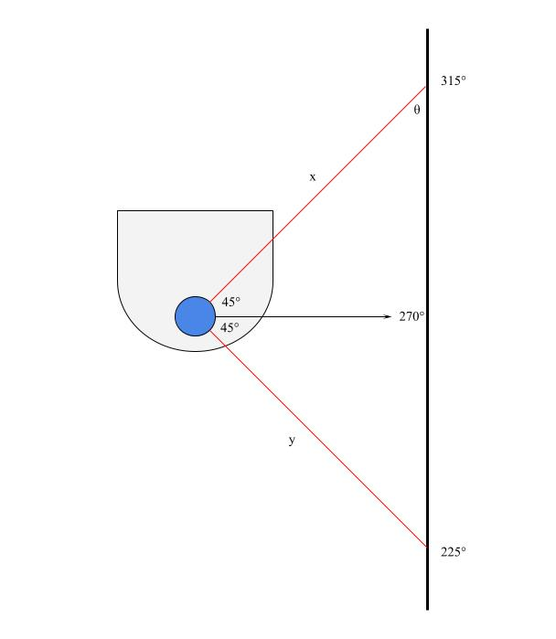

# Warmup Project

Course: A Computational Introduction to Robotics, Spring 2023

Professor: Paul Ruvolo

## Directions

In your github repository, create a markdown file called README.md to serve as documentation for your project. Your writeup should answer the following questions. We expect this writeup to be done in such a way that you are proud to include it as part of your professional portfolio. As such, please make sure to write the report so that it is understandable to an external audience. Make sure to add pictures to your report, links to Youtube videos, embedded animated Gifs (these can be recorded with the tool peek).

- For each behavior, describe the problem at a high-level. Include any relevant diagrams that help explain your approach. Discuss your strategy at a high-level and include any tricky decisions that had to be made to realize a successful implementation.
- For the finite state controller, what was the overall behavior. What were the states? What did the robot do in each state? How did you combine and how did you detect when to transition between behaviors? Consider including a state transition diagram in your writeup.
- How was your code structured? Make sure to include a sufficient detail about the object-oriented structure you used for your project.
- What if any challenges did you face along the way?
- What would you do to improve your project if you had more time?
- What are the key takeaways from this assignment for future robotic programming projects? For each takeaway, provide a sentence or two of elaboration.

## Project Overview

## Behaviors

- For each behavior, describe the problem at a high-level. Include any relevant diagrams that help explain your approach. Discuss your strategy at a high-level and include any tricky decisions that had to be made to realize a successful implementation.

### Robot Teleop

### Driving in a Square

### Wall Following

The objective of this behavior is to pilot or place the neato near a wall and to have the neato follow the wall at a fixed distance, parallel to the wall. The main tool used in this behavior was the neato's lidar sensor.

#### Approach

<figure
    style=
        "display: block;
        margin-left: auto;
        margin-right: auto;
        width:60%;"
>
    
</figure>

My wall following approach was to keep the angle labeled `θ` in the diagram as close to 45° as possible. This is because if the neato is parallel to the wall, the lidar scan at 270° will be perpendicular to the wall; furthermore, the lidar scan at 315° creates a 45° angle with the lidar scan at 270°. These facts imply that when the neato is parallel to the wall, `θ` will be 45°.

The lidar scans at 225° and 315° (distances labeled as `y` and `x` in the diagram, respecively) create a right triangle that allows `θ` to be calculated as follows:

```
θ = atan(y / x)
```

Given that the neato is trying to optimize Scenario: `θ`, there are a few scenarios possible as it follows the wall, which are shown below.

<figure
    style=
        "display: block;
        margin-left: auto;
        margin-right: auto;
        width:60%;"
>
    
</figure>

In this implementation, the neato drives at a constant linear velocity, and its angular velocity is proportional to how far `θ` is from 45°.

### Limitations

In general, the neato can only follow a wall that is on its right side, which means that its starting angle needs to be such that the wall is generally located on its right side. Furthermore, the neato does not respond appropriately when there is a wall directly in front of it or when there is a gap in the wall it is currently following.

Both of these limitations in my implementation come from a trade-off of exploring this behavior as deeply as possible versus having time to sufficiently explore the following behaviors.

### Tricky Decisions

The biggest challenge I encountered with this behavior was transitioning from the simulator to real life; specifically, I did not realize how tricky it would be to get good data from the neatos lidar sensor. Because of this, I needed to build in some redundancy in my angle calculations and base it off of multiple angles as shown below.

<figure
    style=
        "display: block;
        margin-left: auto;
        margin-right: auto;
        width:60%;"
>
    
</figure>

Each angle `φ` is calculated using the same `arctan` formula as above, at various lidar angles, denoted as `ψ`. Using the fact that the sum of the angles of the inner triangle must be 180° and solving for `θ`, the following formula is reached:

```
θ = φ - 225 + ψ
```

This method allows for redundancy by calculating `θ` multiple times using different data points. The neato uses the mean of the angle measurements it calculates to make its turning decisions.

### Person Following

### Obstacle Avoidance

## Finite State Controller

- For the finite state controller, what was the overall behavior. What were the states? What did the robot do in each state? How did you combine and how did you detect when to transition between behaviors? Consider including a state transition diagram in your writeup.

## Code Structure

- How was your code structured? Make sure to include a sufficient detail about the object-oriented structure you used for your project.

## Challenges

- What if any challenges did you face along the way?

## Future Improvements

- What would you do to improve your project if you had more time?

## Key Takeaways

- What are the key takeaways from this assignment for future robotic programming projects? For each takeaway, provide a sentence or two of elaboration.
