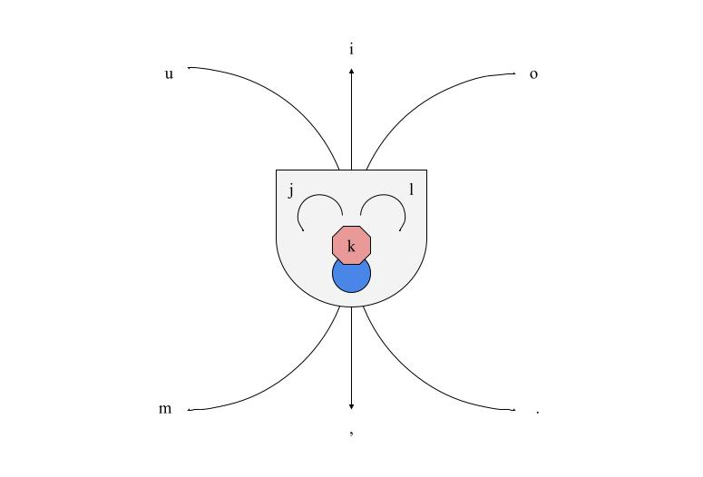
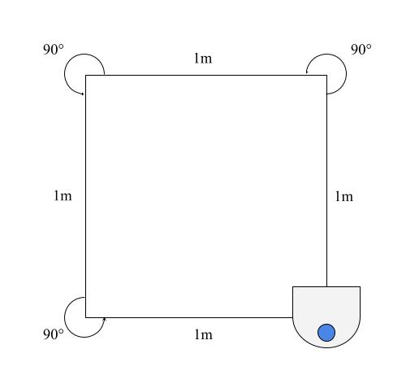
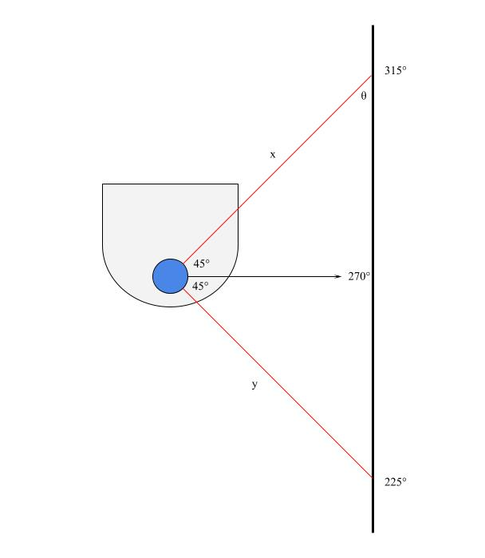
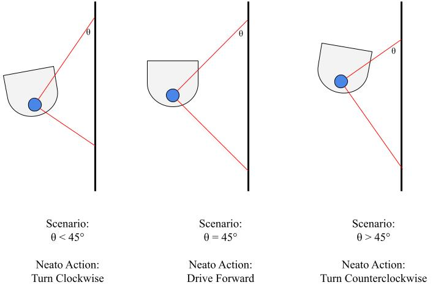
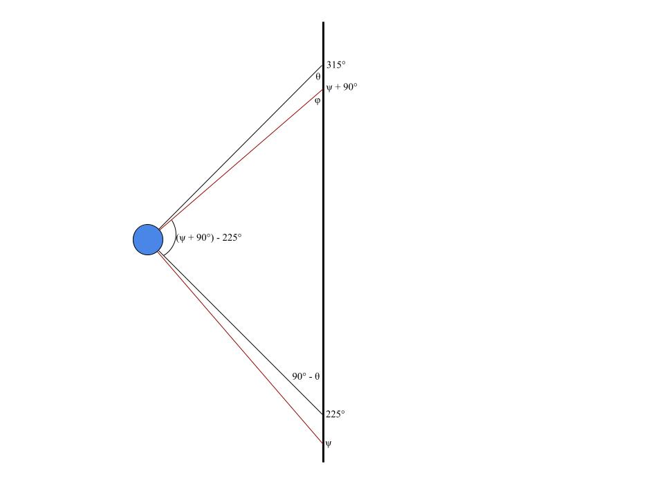
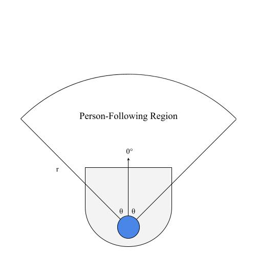
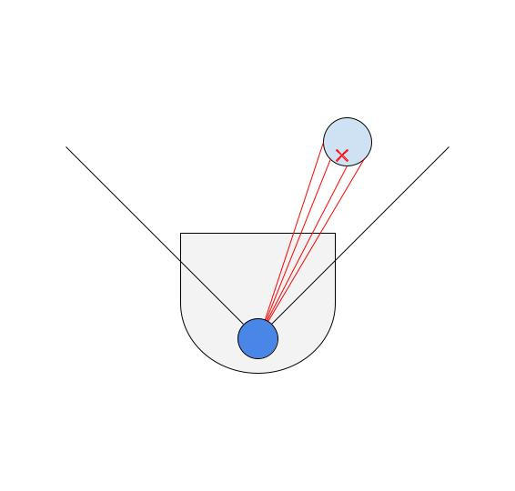
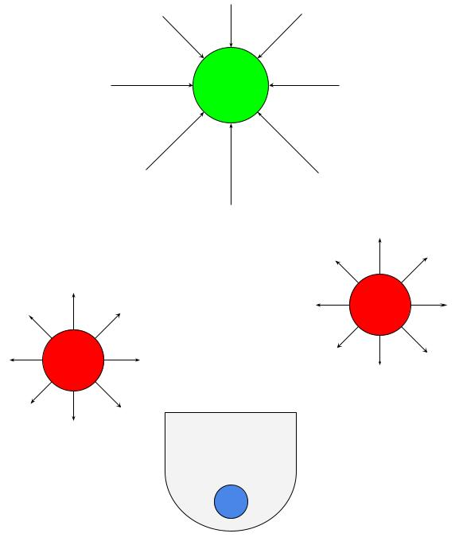
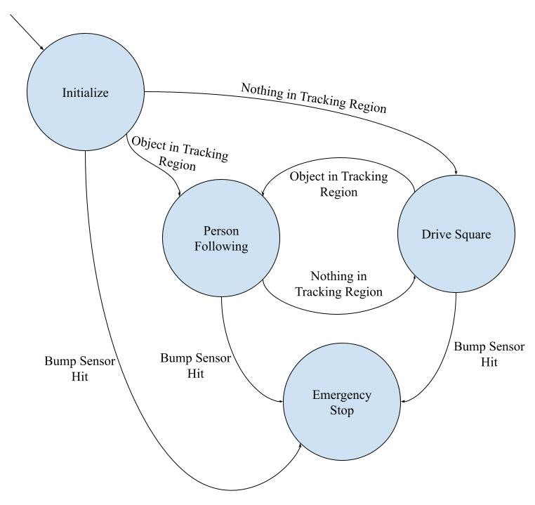

# Warmup Project

Course: A Computational Introduction to Robotics, Spring 2023

Professor: Paul Ruvolo

## Project Overview

## Behaviors

### Robot Teleop

#### Objective

The goal of this behavior is to control the motion of the neato using keys on a keyboard in order to remotely drive the neato.

#### Approach

The approach taken to complete this behavior was to first collect user input from the keypad. In this implementation the characters `u`, `i`, `o`, `j`, `k`, `l`, `m`, `,`, and `.` were mapped to a corresponding motion as shown in the diagram below. If `ctrl+c` is pressed, the neato will stop taking input.

<figure
    style=
        "display: block;
        margin-left: auto;
        margin-right: auto;
        width:60%;"
>
    
</figure>

Additionally, the neato will ignore any keystrokes that are not in the set listed above.

#### Limitations

I think the main limitation of this implementation is that the neato's linear and angular velocity is fixed by the program, and there is no way to change those parameters while the node is running. I think it would be interesting to add a feature that would allow for speeding up and slowing down the neato.

#### Tricky Decisions

The biggest challenge of this behavior was determining a logical way to map behaviors to keystrokes. Because the neato cannot move linearly in its `y` plane, the keystrokes corresponding to those directions turn the neato in place. All of the diagonal keystrokes drive the neato in an arc towards the corresponding direction. I think this was the most intuitive was to map the motions, and I also modeled this off of the `teleop_twist_keyboard` node.

#### Results

### Driving in a Square

#### Objective

The goal of this behavior is to have the neato drive in a 1m x 1m square.

#### Approach

<figure
    style=
        "display: block;
        margin-left: auto;
        margin-right: auto;
        width:60%;"
>
    
</figure>

The approach taken in this implementation is a timer-based approach, in which the neato either turns or travels straight for a set time based on its linear and angular velocity as shown below.

```
turn_duration = turn_angle / angular_velocity
```

```
travel_duration = travel_distance / linear_velocity
```

The start time of a given action (turning or driving) is recorded, and the neato either turns or drives straight forward until it meets the required duration. At this point, the neato switches to the other action. In this way, the neato alternates between driving and turning.

The neato knows that it has completed the square by counting the number of turns it has made. As shown in the diagram, the square has 3 turns, and the neato is programmed to not do more than 3 turns.

#### Limitations

There is a limitation to using timing as a method of tracking turn angle and travel distance. I found that after the first couple of turns, the neato would start getting off 90°. I think this is because the expected duration is based on ideal conditions, but the neato wheels aren't necessarily going at the exact speed they should be due to environmental factors such as friction. A way to mitigate this in a future implementation could be to track distance and turn angle based on the neato's built-in odometry.

#### Tricky Decisions

This implementation went fairly smoothly; there were no real tricky decisions that I came across during implementation.

#### Results

### Wall Following

#### Objective

The objective of this behavior is to pilot or place the neato near a wall and to have the neato follow the wall at a fixed distance, parallel to the wall. The main tool used in this behavior was the neato's lidar sensor, which returns a list of 360 values, indicating how far objects are from the neato at each degree around it. The scan starts at 0°, which is directly in front of the neato, and takes measurements at 1° increments counterclockwise.

#### Approach

<figure
    style=
        "display: block;
        margin-left: auto;
        margin-right: auto;
        width:60%;"
>
    
</figure>

My wall following approach was to keep the angle labeled `θ` in the diagram as close to 45° as possible. This is because if the neato is parallel to the wall, the lidar scan at 270° will be perpendicular to the wall; furthermore, the lidar scan at 315° creates a 45° angle with the lidar scan at 270°. These facts imply that when the neato is parallel to the wall, `θ` will be 45°.

The lidar scans at 225° and 315° (distances labeled as `y` and `x` in the diagram, respecively) create a right triangle that allows `θ` to be calculated as follows:

```
θ = atan(y / x)
```

Given that the neato is trying to optimize Scenario: `θ`, there are a few scenarios possible as it follows the wall, which are shown below.

<figure
    style=
        "display: block;
        margin-left: auto;
        margin-right: auto;
        width:60%;"
>
    
</figure>

In this implementation, the neato drives at a constant linear velocity, and its angular velocity is proportional to how far `θ` is from 45°.

#### Limitations

In general, the neato can only follow a wall that is on its right side, which means that its starting angle needs to be such that the wall is generally located on its right side. Furthermore, the neato does not respond appropriately when there is a wall directly in front of it or when there is a gap in the wall it is currently following.

Both of these limitations in my implementation come from a trade-off of exploring this behavior as deeply as possible versus having time to sufficiently explore the following behaviors.

#### Tricky Decisions

The biggest challenge I encountered with this behavior was transitioning from the simulator to real life; specifically, I did not realize how tricky it would be to get good data from the neatos lidar sensor. Because of this, I needed to build in some redundancy in my angle calculations and base it off of multiple angles as shown below.

<figure
    style=
        "display: block;
        margin-left: auto;
        margin-right: auto;
        width:60%;"
>
    
</figure>

Each angle `φ` is calculated using the same `arctan` formula as above, at various lidar angles, denoted as `ψ`. Using the fact that the sum of the angles of the inner triangle must be 180° and solving for `θ`, the following formula is reached:

```
θ = φ - 225 + ψ
```

This method allows for redundancy by calculating `θ` multiple times using different data points. The neato uses the mean of the angle measurements it calculates to make its turning decisions.

#### Results

### Person Following

#### Objective

The objective of this approach is to have the neato follow a person that enters its tracking area (below) and stay a fixed distance away from the person it is following. The main tool used in this implementation is the neato's lidar sensor.

#### Approach

<figure
    style=
        "display: block;
        margin-left: auto;
        margin-right: auto;
        width:60%;"
>
    
</figure>

The neato's tracking region is defined by an angle `θ` from the neato's 0° and a radius, `r`. From the lidar scan data that the neato recieves, it only utilizes data from the angles within the specified region whose values are less than or equal to `r`.

<figure
    style=
        "display: block;
        margin-left: auto;
        margin-right: auto;
        width:60%;"
>
    
</figure>

As shown in the diagram above, the neato senses something in its tracking region. The centroid of the points is calculated in polar coordinates (radius, angle to target from the neato's 0°) and used to inform the neato's behavior. If the angle is negative, the neato will turn clockwise, and if the angle is positive, the neato will turn counterclockwise. The speed at which the neato turns is proportional to the angle. Furthermore, the neato's linear velocity is proportional to the distance to the target minus the desired following distance. Thus, if the neato gets too close to the target, or the person starts walking towards the neato, the neato will back up.

#### Limitations

The biggest limitation of this algorithm is what happens if there are multiple objects in its tracking region, or if a wall enters its tracking region. Due to the method of calculating the centriod, if there are two people in its tracking region, for example, it will try to follow a spot in between them. Furthermore, a wall is a dense collection of points on the lidar scan, while a person only shows up as a few points. Because of this, the neato will attempt to 'follow' a wall, if one enters its field of view. Thus, this person-follower works best in ideal conditions, but behaves very poorly otherwise.

#### Tricky Decisions

The toughest part of implementing this behavior was managing the issue described in the previous section. One solution I found to mitigate it a little bit was to limit the angle and radius of the tracking region, so that it doesn't pick up on extranious objects. This worked fairly decently, but also means that the person needs to be very close to the neato to be followed.

#### Results

### Obstacle Avoidance

#### Objective

The objective of this behavior is to have the neato drive towards a set goal, while avoiding obstacles that might be in its way. For example, if its goal is behind an obstacle, the neato should be able to drive around the obstacle to reach the goal. The primary tool used in this implementation is the neato's lidar sensor.

#### Approach

The approach taken by this implementation is using a potential field to guide the neato.

<figure
    style=
        "display: block;
        margin-left: auto;
        margin-right: auto;
        width:60%;"
>
    
</figure>

At a high level, the goal exerts an attractive force on the neato, causing it to drive towards the goal; the obstacles exert a repulsive force on the neato, causing it to drive away from them. The sum of forces on the neato can be mapped to every point on the plane, creating a potential field. If the neato follows the direction of the potential field as it drives, it should make its way to the goal, due to its attracive nature. The implementation of this algorithm was strongly influenced by [Michael A. Goodrich's `Potential Fields Tutorial`](https://phoenix.goucher.edu/~jillz/cs325_robotics/goodrich_potential_fields.pdf).

This implementation treats the goal as a single point, provided to the neato as an ordered pair in its coordinate frame, and each of the data points collected on the neato's lidar are treated as obstacles with a radius of 0.

Because each obstacle is in the form of polar coordinates, the repulsive force on the neato from each obstacle is broken down into its x and y components in the neato's coordinate frame. The magnitude of the force is scaled in proportion to the distance the neato is from the obstacle (the force increases in magnitude the closer the neato gets), as well as with a scaling factor, `β`, and its direction is always away from the obstacle. The attractive force on the neato is calculated the same way, but the attractive force always points towards the goal and increases in magnitude as the neato gets farther away and includes a scaling factor, `α`.

The net force on the neato is expressed as the sum of repulsive and attractive forces in the x-direction and the sum of the repulsive and attractive forces in the y-direction. This vector is converted back into polar coordinates, where its magnitude is used to scale the neato's linear velocity, and its angle is used to scale the neato's angular velocity. The neato drives in the direction of the angle, with its velocity proportional to the angle and distance to the target. Thus, the neato always attempts to drive in the direction of the net force acting on it.

#### Limitations

The most important limitation is that the neato behaves very unintuitively in tight areas with walls, tables, chairs, etc. This is because the goal is only a single point, while the neato interprets each point on its lidar scan as an obstacle; therefore, it is possible for the repulsive forces from a wall to completely overpower the neato and have it crash into a much smaller obstacle or drive completely away from the goal. The best way to mitigate this issue is to make use of `α` and `β`. By increasing the strength of the goal and decreasing the strength of the obstacles, the neato will be less likely to make irrational decision. Additionally, I had success with limiting the effective range of obstacles, so that they only act on the neato when they're very close.

#### Tricky Decisions

The biggest implementation challenge I encountered was translating the mathematical model in the paper into functional code. The potential field would have worked a lot better if the lidar scan data was fit to shapes, and each shape acted as one obstacle with some radius; however, in the interest of time, I chose the simplest potential field approach. Furthermore, because the paper assumed the obstacles had a radius, while my obstacles were just points, I had to deviate from the tutorial slightly in how repulsive forces were calculated.

Additionally, I wanted to have the neato be able to move to a goal specified in its own coordinate frame. Because of this, I had to work with the neato's odometry to determine how far it had traveled and update its relative location to the goal. This was done by taking the provided target in the neato's coordinate frame and converting it to the global frame right at the beginning so that it stays fixed as the neato moves.

#### Results

## Finite State Controller

The overall behavior of my finite state controller was to alternate between person following and driving in a square. When there is a person or object in the neato's tracking region, it should begin following that person; however, if the neato detects nothing in its tracking region, it should begin following a 1 meter x 1 meter square. These are the same behaviors that are described above.

<figure
    style=
        "display: block;
        margin-left: auto;
        margin-right: auto;
        width:60%;"
>
    
</figure>

As shown in the diagram above, the states were as follows: `Initialize`, `Person Following`, `Drive Square`, and `Emergency Stop`.
The arrows are labeled with the stimulus required to change states. The way to understand if there is something in the tracking region was simply to look at the lidar scan data for values within the front portion of the neato within the specified range. Additionally, all states have a path to `Emergency Stop`, which has no paths out, as the neato should stop moving if it hits something. The `Initialize` only has paths out of it because the neato should primarily toggle between the two behaviors.

## Code Structure

- How was your code structured? Make sure to include a sufficient detail about the object-oriented structure you used for your project.

## Challenges

As this was my first time working with ROS, the biggest challenges I had were primarily interfacing with the neato and having it respond to its environment the way I intend it to. Part of this was learning how to write good, modular code that can be used in different places and also allows for easier debugging.

On the same theme, I found it hard to find a balance of testing in the gazebo simulator versus testing in real life. The physical neato almost never behaves the way it does in simulator, which became frustrating at times. The solution I found to this was to use the simulator very early on in catching algorithmic and implementation bugs and to fine tune the program completely with the neato to ensure that it works in real life.

Furthermore, I had some challenges working with rviz2. I think that the biggest hurdle was working with the different reference frames (base_link, odom, world) and making sure that I am plotting my visuals in the appropriate reference frame. Anything that I wanted to move with the neato had to be in its coordinate system, but things like fixed targets needed to be in fixed coordinate frames.

Any other challenges were related to debugging algorithms and taking into account the unreliability of the lidar scanner. For this, I found that taking as many measurements as possible and printing sensor information to the command line were the best solutions to working through bugs.

## Future Improvements

The improvements that I would like to make in the future are all related to the limitations of the behaviors I described above:

- Have the wall follower be able to detect and follow the wall from any orientation.
- Have the person follower be able to distinguish between chairs, tables, walls, ect. and pick up on only a person's feet.
- Improve the accuracy of drive square using the neato's odometry.
- Make the neato's obstacle avoidance more robust, maybe by looking into the RANSAC algorithm to fit shapes to the lidar data.

## Key Takeaways

- Debugging is a lot easier when you understand the flow of information in your program.

  When I was working with sensor data and using it to calculate some values, every time I manipulated the data, I printed the result to the command line. This way, I can sanity-check that each step of the process is working correctly by verifying the numbers look about right and that they are in the format that I intended.

- Before starting to code, break down and visualize the problem and come up with an approach.

  For each behavior, I found it helpful to sketch diagrams about possible scenarios the neato could find itself in and how it should react in those situations. This way, the problem is broken into smaller pieces, which often line up with individual functions.

- Don't work alone on CompRobo projects!

  I chose to work alone on this project because it was my first time working with ROS, and I wanted to make sure I had a solid grasp of the concepts before moving on to harder projects. I think this project was a great learning experience, and I feel much more comfortable with working with ROS; however, it was a lot of work for only one person and consumed a lot more of my time than I would have liked.
